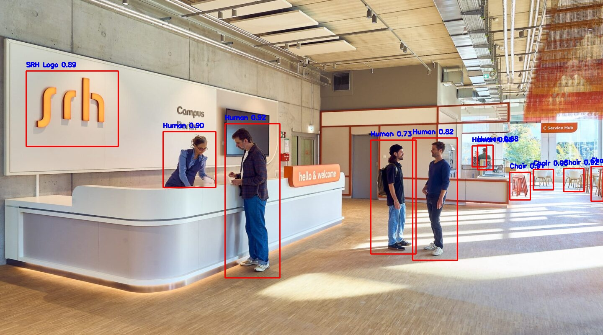

# YOLOv8 Object Detection Training

This project demonstrates how to train the YOLOv8 model from Ultralytics for object detection in both images and videos. The project includes scripts for training the model both locally and in Google Colab, as well as for detecting objects in images and videos using a custom-trained YOLOv8 model.

---

## Example Output



## Table of Contents
- [Project Overview](#project-overview)
- [File Structure](#file-structure)
- [Features](#features)
- [Setup Instructions](#setup-instructions)
  - [1. Clone the Repository](#1-clone-the-repository)
  - [2. Install Dependencies](#2-install-dependencies)
  - [3. Download Pre-trained YOLOv8 Model](#3-download-pretrained-yolov8-model)
  - [4. Prepare the Dataset](#4-prepare-the-dataset)
  - [5. Google Colab Training Instructions](#5-google-colab-training-instructions)
  - [6. Local Training Instructions](#6-local-training-instructions)
- [Running the Scripts](#running-the-scripts)
  - [1. Image Detection](#1-image-detection)
  - [2. Video Detection](#2-video-detection)
- [Customization](#customization)


---

## Project Overview

YOLOv8 (You Only Look Once version 8) is a state-of-the-art object detection algorithm developed by Ultralytics. It can detect multiple objects in real-time with high accuracy. In this project, we fine-tuned the YOLOv8 model on a custom dataset and provided multiple options:
- **Google Colab Training**: Train the YOLOv8 model in Google Colab with GPU support.
- **Local Training**: Train the YOLOv8 model locally.
- **Image Detection**: Detect objects in a static image.
- **Video Detection**: Detect objects in a video file, processing each frame individually.

---

## File Structure

```bash
project/
│
├── data/
│   ├──images/
│   │  ├── train/                 # Training images
│   │  └── val/                   # Validation images
│   └──labels/
│      ├── train/                 # Training labels
│      └── val/                   # Validation labels
│
├── Google_Colab    
│   ├── Colab_Training.ipynb      # Colab notebook for YOLOv8 training
│   └── google_colab_config_college.yaml  # YOLOv8 dataset config for Colab training
│
├── Local_Training     
│   ├── YoloV8.ipynb              # Jupyter notebook for local YOLOv8 training
│   └── config.yaml               # YOLOv8 dataset config for local training
│
├── runs/                         # Directory for storing YOLOv8 outputs (models, logs, etc.)
│   └── detect/
│       └── train/
│           └── weights/
│               └── best.pt       # Trained YOLOv8 model best weights
│               └── last.pt       # Trained YOLOv8 model last weights
│
├── test_images/                  # Folder containing test images
│   └── test1.jpg                 # Example test image
├── test_video/                   # Folder containing test videos
│   └── video_test1.mp4           # Example test video
├── output_images/                # Folder for saving processed images
│   └── out1.jpg                  # Test image Output
├── out_videos/                   # Folder for saving processed videos
│   └── out.mp4                   # Test video Output
│
├── imageDetect.py               # Script for detecting objects in images
├── videoDetect.py               # Script for detecting objects in videos
├── requirements.txt              # List of dependencies
```

---

## Features
- **Custom Object Detection**: Detect custom classes such as "Books", "Humans", "Laptops", etc. present in the college environment
- **Bounding Boxes**: Draw bounding boxes and labels around detected objects in both images and videos.
- **Confidence Filtering**: Only objects detected with confidence higher than a threshold (0.5) are displayed.
- **Pretrained Model**: Utilizes a pretrained YOLOv8 model fine-tuned on custom data.

---

## Setup Instructions

### 1. Clone the Repository
First, clone this repository to your local machine:
```bash
git clone <repository-url>
cd <repository-directory>
```

### 2. Install Dependencies
Install the necessary Python packages using `requirements.txt`:
##### Note: Install `python 3.12+` Interpreter
```bash
pip install -r requirements.txt
```

This will install the following packages:
- `opencv-python`: For image and video handling.
- `torch`: PyTorch, required by YOLOv8.
- `ultralytics`: The YOLOv8 framework.
- `numpy`: For numerical computations.

### 3. Download Pretrained YOLOv8 Model
Download the pretrained YOLOv8 model (`best.pt`) from the training process and place it in the following path:
```
./runs/detect/train/weights/best.pt
```
or we can also replace the downloaded (`last.pt`) from the training process and place it in the following path 
```
./runs/detect/train/weights/last.pt
```

### 4. Prepare the Dataset
Ensure that your dataset follows the proper structure for YOLOv8, with separate folders for images and labels:
```
data/
├── images/
│   ├── train/  # Training images
│   └── val/    # Validation images
└── labels/
    ├── train/  # Training labels
    └── val/    # Validation labels
```

Make sure the `config.yaml` file reflects the correct structure of your dataset:
```yaml
# Add the full path of the images folder in the data_path, train_path, and val_path.

path: ''
train: ''
val: ''

names:
  0: SRH Logo
  1: Book
  2: Laptop
  3: Monitor
  4: Human
  5: Plant
  6: Flowers
  7: Chair
  8: Desk/Table
  9: Mobile Phones
  10: Tablets
  11: Keyboard
  12: Mouse
  13: Cup
  14: Bottle
```

---

### 5. Google Colab Training Instructions
If you prefer to train the model in Google Colab with GPU support, follow these steps:

- **Open the Colab notebook** located in the `Google_Colab` directory:
  - `Colab_Training.ipynb`: A complete Colab notebook for training YOLOv8.
  
- **Configuration file**: The `google_colab_config_college.yaml` file provides the dataset configuration for YOLOv8 training in Google Colab.

- **Run the Colab notebook**: Follow the steps in the notebook to:
  1. Mount your Google Drive.
  2. Install the required dependencies.
  3. Load the YOLOv8 model and start training using the dataset defined in `google_colab_config_college.yaml`.

---

### 6. Local Training Instructions
To train YOLOv8 locally, you can use the notebook in the `Local_Training` directory:

- **Local training notebook**:
  - `YoloV8.ipynb`: A Jupyter notebook for training the YOLOv8 model locally on your machine.

- **Configuration file**: The `config.yaml` file provides the dataset configuration for YOLOv8 local training.

---

## Running the Scripts

### 1. Image Detection
The `imageDetect.py` script processes a static image, detects objects, and saves the output image with bounding boxes and labels.

- **Run the script**:
  ```bash
  python imageDetect.py
  ```

- **Expected Output**:
  The processed image will be saved in the project directory with bounding boxes and labels drawn around detected objects. The output file is defined in `imageDetect.py` as `output_images/output_image1.jpg`.

### 2. Video Detection
The `videoDetect.py` script processes a video file frame by frame, detects objects in each frame, and saves the output as a video with bounding boxes.

- **Run the script**:
  ```bash
  python videoDetect.py
  ```

- **Expected Output**:
  The output video will be saved with bounding boxes around detected objects. The output file is defined in `videoDetect.py` as `out_videos/out.mp4`.

---

## Customization

### Modify the Object Classes
To modify the object classes (e.g., add new classes or change existing ones), edit the `config.yaml` or `google_colab_config_college.yaml` file:
```yaml
names:
  0: SRH Logo
  1: Book
  2: Laptop
  # Add or remove classes as needed
```

### Change Confidence Threshold
In both scripts, you can modify the confidence threshold for object detection. By default, it's set to `0.5` in the bounding box logic:
```python
if conf > 0.5:
    # Draw bounding box
```
You can adjust this value to change the sensitivity of the detection.

### Run on Different Input Files
To run the detection on different images or videos, change the `input_image_path` or `input_video_path` in the respective scripts.

For example, in `Image_Detect.py`:
```python
input_image_path = 'test_images/test2.jpg'  # Modify the path to the image you want to test
```

---
